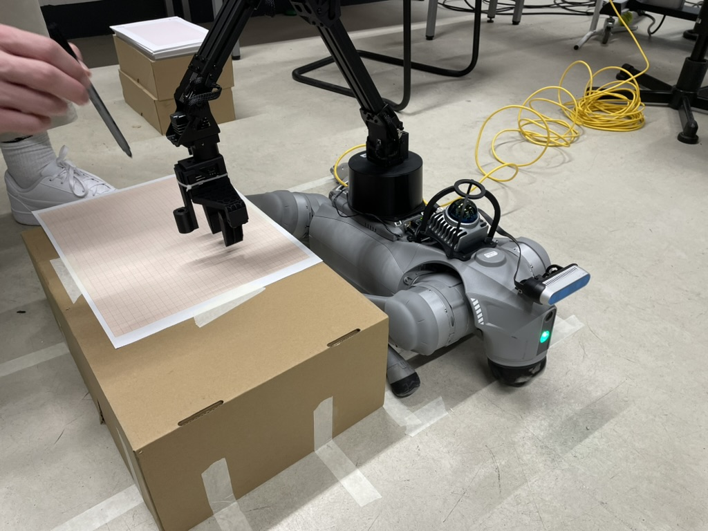

<!-- TABLE OF CONTENTS -->
<details>
  <summary>Table of Contents</summary>
  <ol>
    <li><a href="#experiments-with-go2-quadruped-and-d1-robotic-arm">Experiments with go2 quadruped and d1 robotic arm</a></li>
    <li>
      <a href="#getting-started">Getting Started</a>
      <ul>
        <li><a href="#ressources">Ressources</a></li>
        <li><a href="#prerequisites">Prerequisites</a></li>
        <li><a href="#determine-the-network-interface-ubuntu">Determine the network interface (Ubuntu)</a></li>
        <li><a href="#configure-cyclonedds">Configure CycloneDDS</a></li>
        <li><a href="#sdks">SDKs</a></li>
        <li><a href="#establish-connection-to-go2">Establish Connection to Go2</a>
          <ul>
            <li><a href="#ethernet">Ethernet</a></li>
            <li><a href="#via-ethernet-linuxth-computer">Via Ethernet (Linux/TH-Computer)</a></li>
          </ul>
        </li>
        <li><a href="#troubleshooting-brief">Troubleshooting (brief)</a></li>
        <li><a href="#references-excerpt">References (Excerpt)</a></li>
      </ul>
    </li>
  </ol>
</details>

# Experiments with go2 quadruped and d1 robotic arm
<p align="center">
  
</p>

Source code of go2 and d1 robot arm movements from Forschungsseminar project at TH Cologne.

In order to reproduce the experiments from the paper, you first need to install the required libraries and sdk´s, which is described in the upcoming sections. Then in the "Robot movements" folder you will find the code used to move the d1 arm, the go2 and for the whole pick and place movement of the efficency section.

---
# Getting Started

## Ressources

* **Unitree Website:**
  [https://www.unitree.com/go2](https://www.unitree.com/go2)

* **Unitree SDK Documentation:**
  [https://support.unitree.com/home/en/developer](https://support.unitree.com/home/en/developer)

* **Unitree D1 Documentation:**
  [https://support.unitree.com/home/en/developer/D1Arm_services](https://support.unitree.com/home/en/developer/D1Arm_services)

## Prerequisites

**Tested/Recommended Environments**

- Ubuntu **20.04/22.04**

- Administrator rights for package installation
- (Recommended) Python 3 **venv**

**Required Packages**
```bash

sudo apt update

sudo apt install -y git build-essential cmake g++ \
libyaml-cpp-dev libeigen3-dev libboost-all-dev libspdlog-dev libfmt-dev \
cyclonedds-tools libddsc0t64
```

**Python (for SDK2 Python)**
```bash

python3 -m venv .venv # Create Venv if not already done

source .venv/bin/activate
pip install --upgrade pip
pip install cyclonedds
```

## Determine the network interface (Ubuntu)

Goal: Find the interface that is on the **same subnet** as Go2/D1 (e.g., `192.168.123.x`).

```bash
`ip -br addr`
`ip route get <GO2_OR_D1_IP>`

```
Example output shows `dev <INTERFACE_NAME> ...` using this interface in the DDS configuration below.

## Configure CycloneDDS
Create the file **cyclonedds.xml** in the **project root** (`~/go2-with-d1-experiments/`):

```xml
<?xml version="1.0" encoding="UTF-8" ?>
<CycloneDDS>

<Domain id="any">

<General>

<NetworkInterfaceAddress><INTERFACE_NAME></NetworkInterfaceAddress>

<AllowMulticast>true</AllowMulticast>

</General>

</Domain>
</CycloneDDS>

```
Activate the configuration in the respective terminal:

```bash
export CYCLONEDDS_URI=file://$PWD/cyclonedds.xml

```
> Note: This variable is deprecated, but sufficient for this quick start.

## SDKs
### Unitree Python SDK Installation

Installation and instructions: [unitree_sdk2_python](https://github.com/unitreerobotics/unitree_sdk2_python)

### Unitree SDK

Download the package: [unitree_sdk2](https://github.com/unitreerobotics/unitree_sdk2) 

Installation Guide: https://support.unitree.com/home/en/developer/Quick_start

### D1 SDK

Install D1-Arm SDK from this repository via cmake command in the terminal.


## Establish Connection to Go2

### **Ethernet**

Go2-IP (Link-Local): `192.168.123.161`

### Via Ethernet (Linux/TH-Computer)

1. Settings → Network → Ethernet
2. Section IPv4 → Method: Manual
3. Insert:
   * Address: `192.168.123.222`
   * Netmask: `255.255.0.0` (=/16)
   * Gateway: *leer lassen*
4. (Optional) Section IPv6 → Ignor
5. Save

**Notes**
* Link-Local works **without DHCP**; use only **directly** on the device.

* If it doesn't work: briefly disconnect/disable other network connections, then reconnect.

* Firewalls/browser plugins/VPNs can cause interference → try temporarily disabling them.


## Troubleshooting (brief)

- **No DDS entities**: Disable Wi-Fi, use LAN only; reset `CYCLONEDDS_URI`; try a different terminal. Disable VPN and firewall.

- **Examples can't find the arm**: Check cabling/24V; run `ddsls -a` and use the exact names.

- **SDK2 build error**: Install CMake/Dev packages as above; run `cmake ..` again.

- **ROS 2 required?** First test SDK2 without ROS, then install ROS 2 according to the Unitree guide.


## References (Excerpt)

- Unitree **DDS Services Interface** (SDK2, QoS, ROS 2): https://support.unitree.com/home/en/developer/DDS_services

- Unitree **Go2 SDK Quick Start** (SDK2 Setup): https://support.unitree.com/home/en/developer/Quick_start

- Unitree **Payload** (Installation Instructions): https://support.unitree.com/home/en/developer/Payload

- Unitree **D1 Arm Services** (Specific Service Documentation): https://support.unitree.com/home/en/developer/D1Arm_services

- Repositories: https://github.com/unitreerobotics/unitree_sdk2 | https://github.com/unitreerobotics/unitree_sdk2_python
